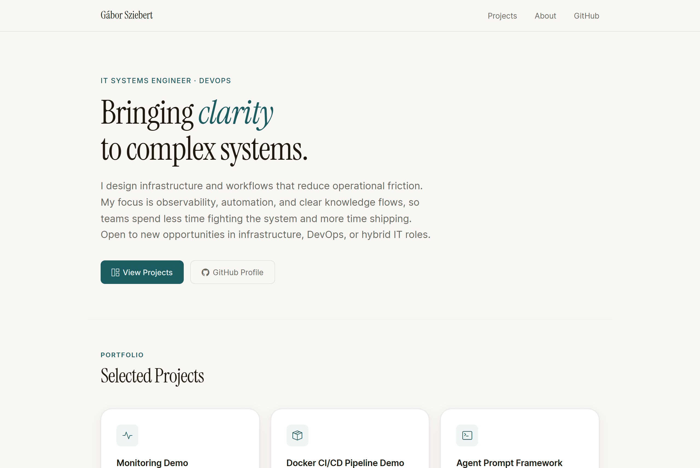

# bwgabor.github.io

Personal portfolio site built with Bootstrap 5 and hosted on GitHub Pages.

[](https://bwgabor.github.io)

---

## 🖼️ Preview



---

## 🛠️ Technologies

- [Bootstrap 5.3](https://getbootstrap.com/) – CSS framework (CDN)
- [GitHub Pages](https://pages.github.com/) – Static hosting
- HTML5, CSS3, Vanilla JS

---

## 🚀 Local setup

```bash
git clone https://github.com/bwgabor/bwgabor.github.io.git
cd bwgabor.github.io
# Open index.html in your browser — no build step needed
open index.html        # macOS
xdg-open index.html    # Linux
start index.html       # Windows
```

---

## 📁 Project structure

```
bwgabor.github.io/
├── index.html # Main portfolio page
├── assets/
│ ├── css/
│ │ └── style.css # Custom overrides on top of Bootstrap
│ ├── js/
│ │ └── main.js # Minimal interaction (e.g. smooth scroll)
│ └── img/
│ └── screenshot.png
├── CHANGELOG.md
└── .github/
└── workflows/ # CI/CD (later)
```


---

## 📋 Changelog

See [CHANGELOG.md](CHANGELOG.md).